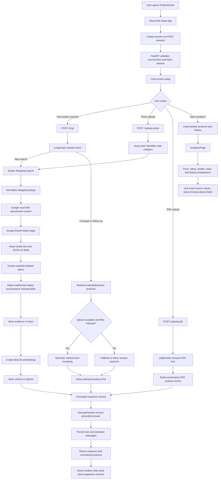

# ProductGenie architecture

## End-to-end system flow



## State

Every LangGraph turn carries `session_id`, `user_query`, `intent`, `chat_history`, `products`, and `response`. Upload paths additionally carry transient `image_bytes` or `pdf_text`. Product records are normalized as `name`, `brand`, `price`, `specs`, `imageUrl`, `source`, and `link`.

## Intent-routing graph

```text
START
  │
  ▼
classify_intent
  ├─ search ───► live_search (Serper /shopping; gl=in, hl=en)
  │                   │
  │                   └──► enrich all listings (Serper exact-title evidence + page text + JSON-LD)
  │                  ▼
  │             source-labeled specs ─► embed_and_store (MiniLM + Qdrant)
  │                                                 │
  ├─ photo ────► vision_identify (Groq vision) ─────┘
  │
  ├─ pdf ──────► parse_pdf (pdfplumber) ─► extract_specs
  │
  ├─ compare ──► retrieve_products (Qdrant; Neon fallback) ─► compare
  │
  └─ followup ─► load_chat_history (Neon Postgres) ─► rerank (Qdrant; Neon fallback)
                                                     │
                                                     ▼
                                                   respond (Groq)
                                                     │
                                                     ▼
                                           save_to_neon → END
```

## Data boundaries

- Serper receives every shopping search with `gl=in` and `hl=en` so prices/retailers are localized for India.
- Every normalized listing keeps the useful Serper result fields (price, rating, delivery, offers, ID, position, and any returned extensions), then receives exact-title search evidence, visible linked-page text, explicit JSON-LD product fields, and conservative label-aware specification extraction.
- Numeric labels are not freely inferred: `8GB RAM 512GB SSD` is kept as `8 GB` RAM and `512 GB` storage. Impossible values such as `000 mAh` are removed, and absent values remain absent.
- Sessions, messages, and product evidence are stored in Neon Postgres. Product embeddings are stored in Qdrant and filtered by session.
- A card selection is verified against trusted session records and placed first in the LLM context for both comparison and follow-up requests. If Qdrant rejects a session filter or is unavailable, persisted Neon product records keep the request usable.
- Responses are instructed to use only retrieved or uploaded evidence. They disclose absent details and discuss trade-offs, rather than inventing a universal winner.

## HTTP lifecycle

`POST /session` creates the session row. A chat or upload validates that session, invokes the graph asynchronously, persists user and assistant messages, and sends normalized products to the React interface. `GET /history/{session_id}` supports session-resume clients.


                         ┌──────────────────────┐
                         │        USER          │
                         │ ProductGenie Request │
                         └──────────┬───────────┘
                                    │
                                    ▼
                         ┌──────────────────────┐
                         │   React / Vite UI    │
                         │   Chat Interface     │
                         └──────────┬───────────┘
                                    │
                         POST /session
                                    │
                                    ▼
                         ┌──────────────────────┐
                         │       FastAPI        │
                         │ Session Validation   │
                         └──────────┬───────────┘
                                    │
                                    ▼
                         ┌──────────────────────┐
                         │     User Action?     │
                         └──────────┬───────────┘
                                    │
             ┌──────────────────────┼──────────────────────┐
             │                      │                      │
             ▼                      ▼                      ▼
      ┌─────────────┐       ┌─────────────┐        ┌─────────────┐
      │ Text Query  │       │ Photo Upload│        │ PDF Upload  │
      └──────┬──────┘       └──────┬──────┘        └──────┬──────┘
             │                     │                      │
             ▼                     ▼                      ▼
      ┌─────────────┐       ┌─────────────┐        ┌─────────────┐
      │ LangGraph   │       │ Groq Vision │        │ pdfplumber  │
      │Intent Router│       │ Identify    │        │ Extract Text │
      └──────┬──────┘       │ Product     │        └──────┬──────┘
             │              └──────┬──────┘               │
             │                     │                      ▼
             │                     │               ┌─────────────┐
             │                     │               │Extract Specs│
             │                     │               └──────┬──────┘
             │                     │                      │
             ├──────────┐          │                      │
             │          │          │                      │
             ▼          ▼          ▼                      │
         ┌────────┐ ┌──────────┐ ┌──────────────┐         │
         │ Search │ │ Compare/ │ │ Serper       │         │
         │        │ │Follow-up │ │ Shopping     │         │
         └───┬────┘ └────┬─────┘ └──────┬───────┘         │
             │           │              │                 │
             │           │              ▼                 │
             │           │       ┌──────────────┐         │
             │           │       │ Normalize    │         │
             │           │       │ Products     │         │
             │           │       └──────┬───────┘         │
             │           │              │                 │
             │           │              ▼                 │
             │           │       ┌──────────────┐         │
             │           │       │ Exact Title  │         │
             │           │       │ Specification│         │
             │           │       │ Search       │         │
             │           │       └──────┬───────┘         │
             │           │              │                 │
             │           │              ▼                 │
             │           │       ┌──────────────┐         │
             │           │       │ Retailer Page│         │
             │           │       │ + JSON-LD    │         │
             │           │       └──────┬───────┘         │
             │           │              │                 │
             │           │              ▼                 │
             │           │       ┌──────────────┐         │
             │           │       │ Extract Valid│         │
             │           │       │ Explicit Specs│         │
             │           │       └──────┬───────┘         │
             │           │              │                 │
             │           │              ▼                 │
             │           │       ┌──────────────┐         │
             │           └──────►│ Neon Postgres│◄────────┘
             │                   │ Evidence DB  │
             │                   └──────┬───────┘
             │                          │
             │                          ▼
             │                   ┌──────────────┐
             │                   │ MiniLM       │
             │                   │ Embeddings   │
             │                   └──────┬───────┘
             │                          │
             │                          ▼
             │                   ┌──────────────┐
             │                   │ Qdrant       │
             │                   │ Vector DB    │
             │                   └──────┬───────┘
             │                          │
             └──────────────┬───────────┘
                            ▼
                  ┌──────────────────────┐
                  │ Product Retrieval    │
                  │ + Semantic Reranking │
                  └──────────┬───────────┘
                             │
                    Qdrant available?
                         /        \
                       Yes         No
                        │           │
                        ▼           ▼
                  ┌──────────┐ ┌──────────┐
                  │ Qdrant   │ │   Neon   │
                  │ Results  │ │ Fallback │
                  └────┬─────┘ └────┬─────┘
                       └──────┬──────┘
                              ▼
                    ┌──────────────────┐
                    │ Grounded Context │
                    │ Selected Products│
                    │ + Evidence       │
                    └────────┬─────────┘
                             │
                             ▼
                    ┌──────────────────┐
                    │   Groq LLM       │
                    │ Generate Answer   │
                    └────────┬─────────┘
                             │
                             ▼
                    ┌──────────────────┐
                    │ Save Conversation │
                    │   in Neon DB      │
                    └────────┬─────────┘
                             │
                             ▼
                    ┌──────────────────┐
                    │ React UI          │
                    │ Product Cards     │
                    │ Comparison        │
                    │ Recommendations   │
                    └──────────────────┘


Analytics Flow :

              User opens Analytics
                       │
                       ▼
              ┌─────────────────┐
              │ Analytics Page  │
              └────────┬────────┘
                       │
                       ▼
              ┌─────────────────┐
              │ Load Products   │
              │ + Chat History  │
              └────────┬────────┘
                       │
                       ▼
              ┌─────────────────┐
              │ Neon PostgreSQL │
              └────────┬────────┘
                       │
                       ▼
        ┌─────────────────────────────┐
        │ Analytics Processing        │
        │ • Price                     │
        │ • Rating                    │
        │ • Retailer                  │
        │ • Features                  │
        │ • Specification comparison  │
        └──────────────┬──────────────┘
                       │
                       ▼
              ┌─────────────────┐
              │ Charts / Radar  │
              │ Feature Matrix  │
              └─────────────────┘